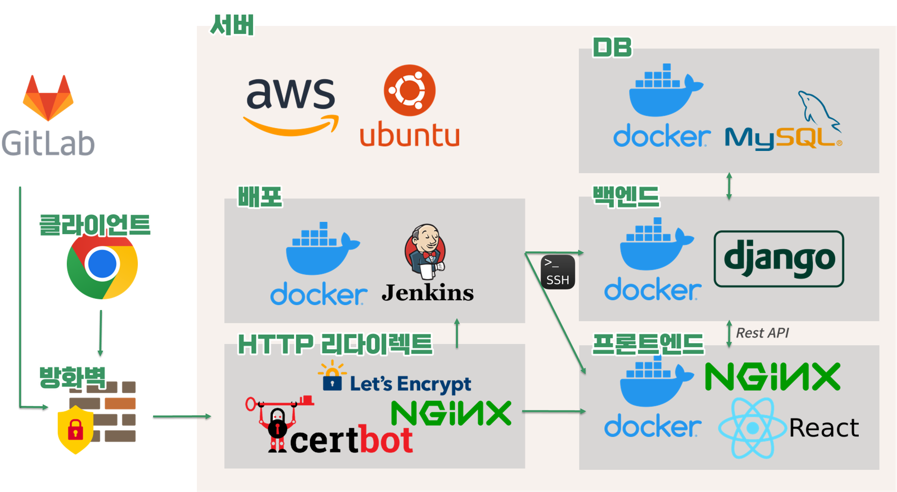
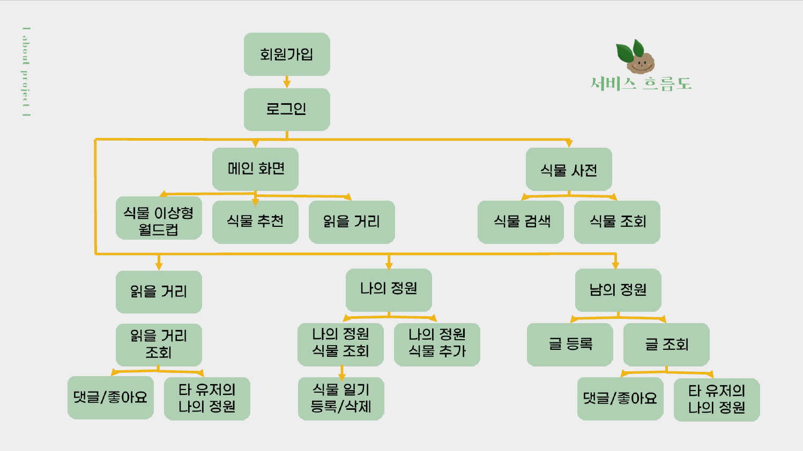
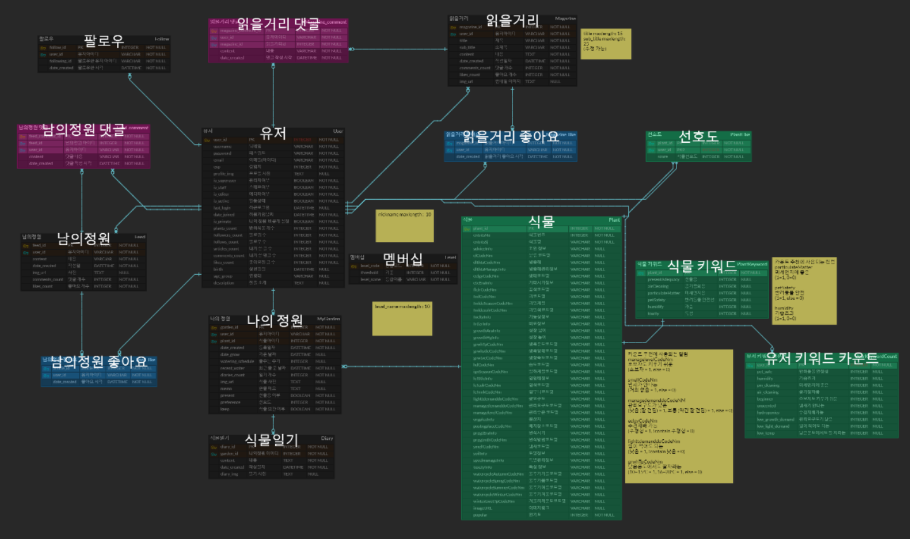
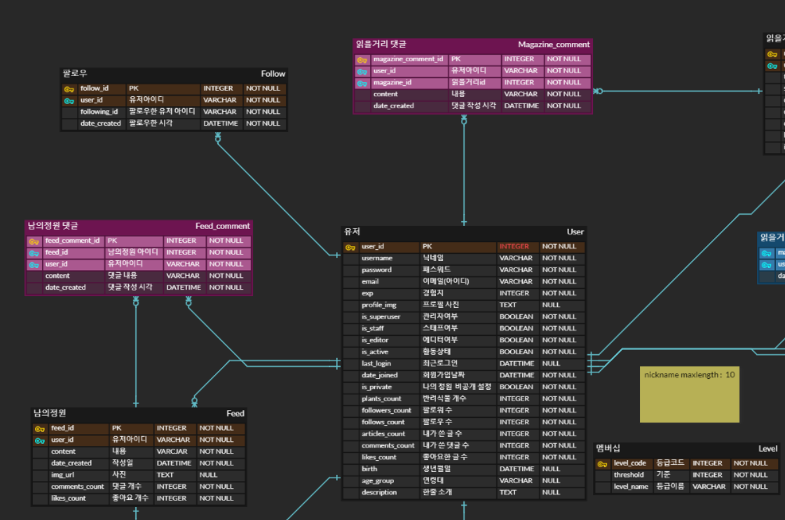
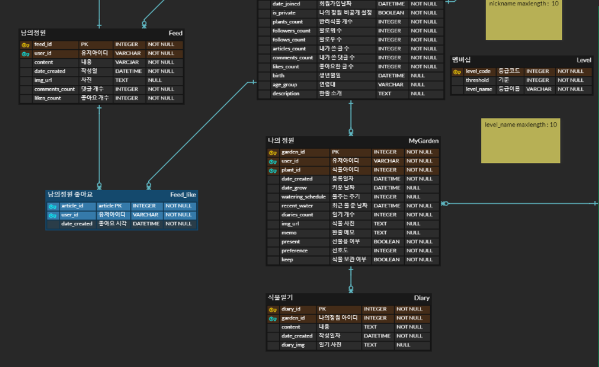
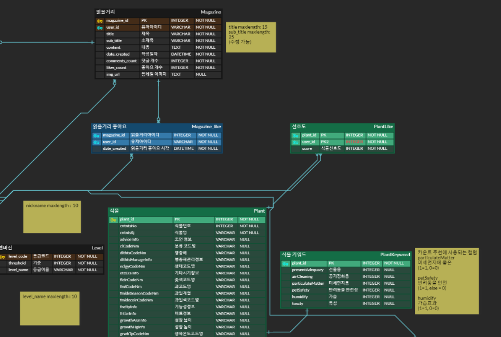
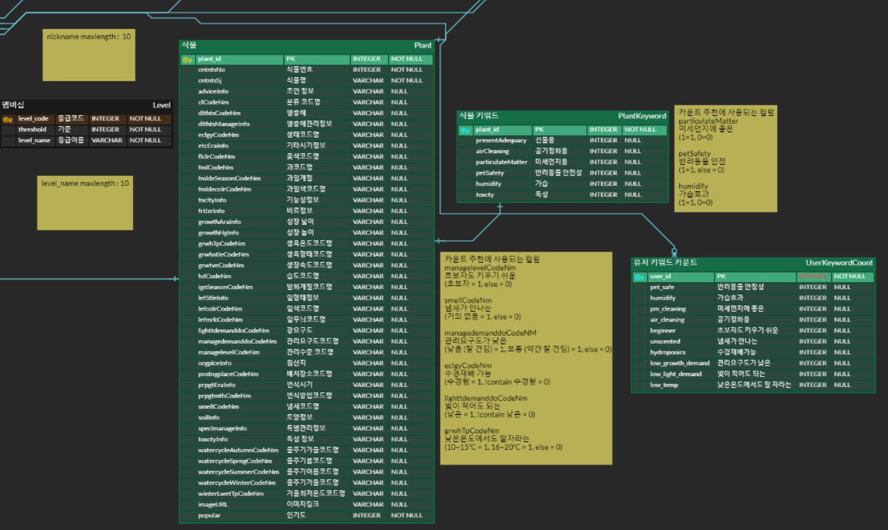
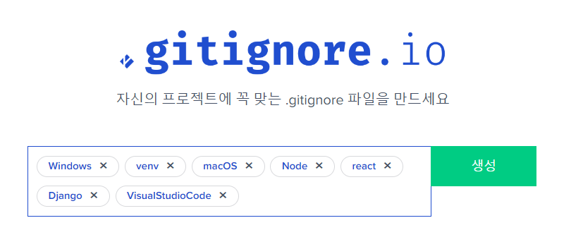

# PLANTY

> 팀명 : 호미두

## 주요 기능

- 유저기반 식물 추천
- 키워드기반 식물 추천
- 나의 정원 시스템을 통한 식물 관리
- 남의 정원 시스템을 이용한 다른 사용자들과의 피드 공유
- 식물 이상형 월드컵

**실내 정원용 식물 추천 서비스**

- 농업진흥청 농업기술포털인 농사로에서 제공하는 실내 식물 공공 API를 활용하여 실내 식물에 대한 데이터를 모으고, 사전 설문 조사를 통해 유저의 식물 선호도를 모았습니다.
- 전처리 후 각 데이터를 DB에 저장하였습니다. 유저가 현재 키우는 식물을 기준으로 유사한 특징을 가진 식물을 추천(카운트 기반)하거나 유사한 식물을 키우고 있는 타 유저와 비교하여 새로운 식물을 추천(유저 기반)합니다.
- 지속적인 서비스 이용을 위해 큐레이션 기반 SNS를 차용하여 유저들이 식물 및 정원 사진을 공유할 수 있는 남의 정원, 본인의 식물을 관리할 수 있는 나의 정원 페이지를 제공합니다.

</br>
</br>

# ⚙️ 시스템 환경 및 구성

## 시스템 환경

- AWS, ubuntu

## 개발 환경

- Front
  - React 17.0.2
- Back
  - Django
- DB
  - MySQL
- 형상관리
  - Git

## 협업 툴

- Git
- Jira
- Notion
- Webex
- Mattermost

</br>
</br>

# 시스템 아키텍처



</br>
</br>

# 시스템 흐름도



</br>
</br>

# 데이터 설계

## ERD







</br>
</br>

# Detail

**프로젝트 계기**

💡 실내에 머물러 지는 시간이 길어지는 만큼, `반려 식물`이라는 말이 부상하는 만큼, 실내 식물에 대한 관심도가 높아지는데, 처음 키우는 사람부터 식물을 많이 키워본 사람까지 새로운 `식물을 추천 받을 수 있는 식물 추천 서비스`를 기획하였습니다.

</br>

**맡은 일**

👉 `프론트엔드` 기능 구현을 위주로 `전반적인 웹페이지 기능`, 디자인을 맡았습니다. 또한 `데이터` 수집 및 가공, 정제, 분석을 진행하였습니다.

</br>

**어려웠던 점 및 배운 점**
📖 
1. 6명의 팀원을 다시 세 개의 팀으로 나누면서 팀 간 소통하는 것이 가장 어려웠습니다. 전체적인 진행 상황을 파악하기 보다 각 팀 내에서만 업무를 진행하다 보니 전체 코드 테스트를 할 때 버벅임이 있었습니다. 이후 매일 스크럼 미팅을 갖고, Jira와 노션을 적극적으로 활용하며 팀 별 업무와 진행 상황을 적극적으로 공유하여 모든 팀원이 프로젝트 전체 및 세부 진행 상황을 이해할 수 있도록 하였습니다.

2. React 의 상태관리를 이해하는데 어려움이 있었습니다. 단순히 useState, useEffect등의 훅만 이용해서 구현했을 땐 리렌더링 이슈가 많았고, 코드 수정 등과 같은 유지보수를 하는데 불편한 점이 많았습니다. 상태 관리를 위해 Redux 라이브러리를 사용해서 전역에서 상태관리를 해 주어, 무분별한 훅 사용을 줄이고, 유지보수를 용이하게 하였습니다.
   
3. 데이터의 수집, 가공, 정제등을 진행하며 의미있는 데이터를 추출하는법과 데이터를 시각화 하며 분석하여 유의미한 데이터를 만드는 것이 시간이 오래걸렸습니다.

</br>
</br>

# Git 컨벤션 및 협업 전략

## Git 컨벤션

- gitmessages.txt 활용
- 이모지를 활용하여 커밋 종류 표현

`gitmessage.txt`

```
################
# <이모지> <제목> 의 형식으로 제목을 아래 공백줄에 작성
# 제목은 50자 이내 / 변경사항이 "무엇"인지 명확히 작성 / 끝에 마침표 금지
✨ 커밋 제목

# 바로 아래 공백은 지우지 마세요 (제목과 본문의 분리를 위함)

################
# 본문(구체적인 내용)을 아랫줄에 작성
# 여러 줄의 메시지를 작성할 땐 "-"로 구분 (한 줄은 72자 이내)
- 내용 1
- 내용 2
################
# 꼬릿말(footer)을 아랫줄에 작성 (현재 커밋과 관련된 이슈 번호 추가 등)
# Jira Smart commit 사용 시 Jira 이슈 또한 종료할 수 있음.
# 예) Close #7

################
# ✨ : 새로운 기능 추가
# 🐛 : 버그 수정
# 📚 : 문서 수정
# 🚨 : 테스트 코드 추가
# 🔨 : 코드 리팩토
# 📝 : 코드 의미에 영향을 주지 않는 변경사항
# 🔧 : 기타 변경사항, 프로`덕션 코드 변경사항 없음
################
```

- `--local` 은 해당 프로젝트에서만 적용
- `--global` 로 수정하면 컴퓨터에 있는 모든 깃 프로젝트에 적용

```bash
git config --local commit.template .gitmessage.txt
```

```bash
$ git add .

$ git commit
# 이후 gitmessage 작성
```

- 이 때 터미널 환경에서 `git commit`을 입력하면 `vi 에디터` 환경으로 나올 것입니다.
- 작성할 때에는 키보드 `i` 키를 누르면 되며, 작성 완료하고 저장하려면 `esc` 키를 누른 다음 `:wq!` 를 입력하고 엔터를 누르시면 됩니다.

## MR 템플릿

```
# Merge Request

## Part

- [ ] FE
- [ ] BE
- [ ] Data

## 어떤 이유로 MR를 하셨나요?

- [ ] feature 병합(feature issue #를 남겨주세요)
- [ ] 버그 수정(아래에 issue #를 남겨주세요)
- [ ] 코드 개선
- [ ] 기타(아래에 자세한 내용 기입해주세요)

## 기능 상세 설명

- 기능에서 어떤 부분이 구현되어야 하는 지 설명해주세요
```

## 협업 전략

```bash
$ git init
$ git remote add origin 개인 레포지토리 주소
$ git remote add upstream 팀 레포지토리 주소

$ git pull upstream 브랜치 ** 현재 함께 작업 중인 팀의 작업 내용은 꼭 풀 해야함**
$ git add .
$ git commit -m 커밋 메시지
$ git push origin 브랜치
```

1. 내 레포지토리의 브랜치에 푸시
2. 내 레포지토리에서 팀 레포지토리로 머지 리퀘스트 넣기

## Git ignore



</br>
</br>

# 팀원 소개 및 역할

### Backend

- 장지선(팀장)
- 김지현

### Frontend

- 조현빈
- 홍성목

### Data

- 백승진
- 이수민