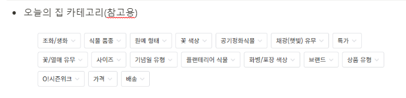
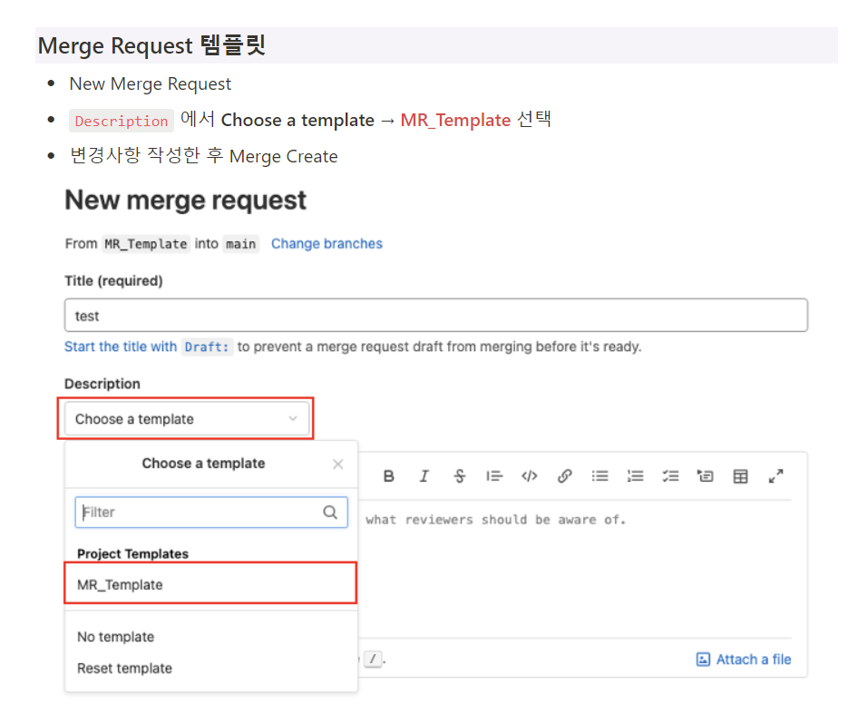

### 1. 어떤 서비스를 제공할지

- 실내에서 키우기 좋은 반려 식물 추천 서비스
- 유저가 키우고 있는 식물 관리

### 2. 어떤 정보로 서비스를 제공할지

- API 데이터 기반
  - 물 주는 주기 (계절별)
  - 생장 높이 및 너비
  - 광량
  - 재배 방식(수경/흙)
  - 식용?
  - 생육 주기
  - 난이도
  - 색상
  - 해충
- 기타
  - 특징/기능
    - 인테리어
    - 공기 정화
    - 벌레 잡이 (실내 식물데이터에는 없음)

테스트용클로즈..

0902_컨벤션 연습

