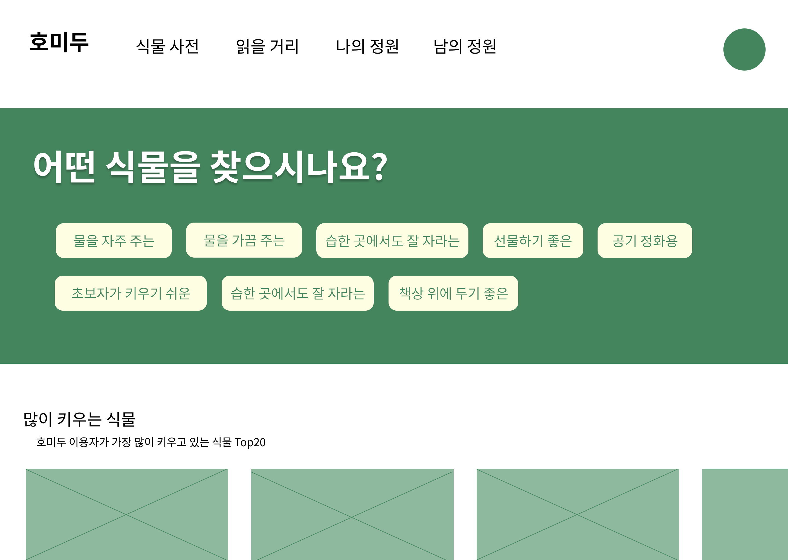
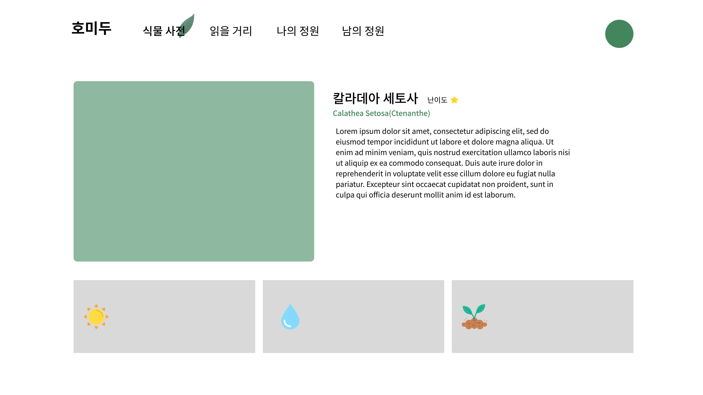
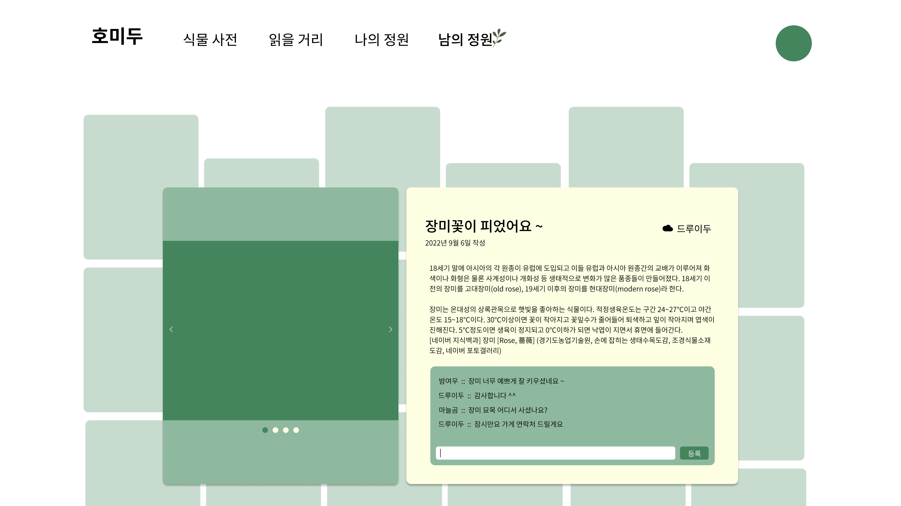

# Today I Learn

> 7기 부울경 특화 1반 김지현

<br/>

### 9월 1일 목요일

> 아이디어 정리
> 
> 서비스 방향 및 디테일 설정

#### 1. 아이디어 정리

* 농업정보포털의 `실내정원용` 식물 및 `건조에 강한 실내식물` 공공 데이터 사용

* 클러스터링을 활용한 추천

* 유저 간 선호도(유사도 측정) 기반의 추천
  
  * 신규 유저에게 받을 설문
  
  * 서비스 제공 전 설문 조사를 통한 데이터 수집

#### 2. 서비스 방향

* 실내에서 키우기 좋은 **반려 식물 추천** 서비스

* 식물 전반에 대한 백과 사전(실내 식물 외에도 검색 가능)

* 현재 유저가 키우고 있는 식물 관리
  
  * 재배 환경 등에 변수가 다양하므로 데이터 기반의 알림 X
  
  * 유저가 입력한 정보에 맞추어서 물 주기, 영양제 주기 등을 알림
  
  * 사진 등록 기능 추가

* 다른 유저가 키우고 있는 식물/ 관리하고 있는 정원 둘러 보기
  
  * 댓글, 좋아요, 팔로우 기능 논의 필요

#### 3. 서비스 상세

>  어떤 정보를 제공할 것인가

* API 기반
  
  * 계절별 물 주는 주기 => 유저의 성격에 따른 추천
  
  * 생장 높이 및 너비 => 창가, 베란다, 책상 위 등의 재배 위치 추천
  
  * 광량, 습도 => 재배 환경에 따른 추천
  
  * 난이도 => API가 제공하는 난이도 외에 유저 정보로도 확장 가능
  
  * 색상
  
  * 해충
  
  * 재배 방식

* 기타
  
  * 구매 목적
    
    * 인테리어, 공기 정화, 벌레 잡이 등
  
  * 가격
  
  * 취향
    
    * 유저 기반 데이터 분석

#### 4. 참고 사이트

* [협업 필터링이란](https://investraveler.tistory.com/252)

* [빅데이터로 알아보는 반려식물 | 농사로](http://www.nongsaro.go.kr/portal/ps/psv/psvr/psvre/curationDtl.ps?menuId=PS03352&srchCurationNo=1696 "http://www.nongsaro.go.kr/portal/ps/psv/psvr/psvre/curationDtl.ps?menuId=PS03352&srchCurationNo=1696")

* [플립](https://www.fuleaf.com/)
  
  * 구상 중인 서비스와 유사함
  
  * 추천 서비스는 제공 X 단순 필터링을 통한 정보만 제공 중
  
  * 스토어 운영을 통한 경제 가치 창출

<br/>

---

<br/>

### 9월 2일 금요일

> 남의 정원, 읽을 거리 아이디어 확정
> 커밋 컨벤션
> 
> - 커밋 메시지 템플릿화
> 
> - MR 템플릿
> 
> 포크 가이드 by 현빈님

#### 1-1. 남의 정원

* 인스타그램 + 핀터레스트 느낌

* 사진 중심

* 짧은 글

* 좋아요, 댓글 기능으로 소통

#### 1-2. 읽을 거리

* 농사로 등에서 얻은 공공 데이터 기반으로 읽을 만한 글 제시

* 활동 점수로 레벨이 높은 유저에게는 글 쓰기 권한 부여
  
  * 유저 신청 필요

#### 2. 커밋 컨벤션

```bash
git config --local commit.template .gitmessage.txt
```

#### 3. Merge Request 템플릿

[노션에서 보기](https://www.notion.so/1872e235f72744288336c8cd2679b352#f5ba526b98e6439e9235c997981c1b2e)

#### 4. 포크 가이드

```bash
$ git init
$ git remote add origin 개인 레포지토리 주소
$ git remote add upstream 팀 레포지토리 주소

$ git pull upstream 브랜치 # 현재 함께 작업 중인 팀의 작업 내용은 꼭 풀 해야함
$ git add .
$ git commit
$ git push origin 브랜치
```

1. 내 레포지토리의 브랜치에 푸시
2. 내 레포지토리에서 팀 레포지토리로 머지 리퀘스트 넣기

<br/>

---

<br/>

### 9월 5일 월요일

> 최종 기획
> 데이터 수집
> 와이어프레임 & 목업 작성

#### 1. 최종 기획

* 나의 정원
  
  * 레벨과 포인트를 따로 => 자주 접속해서 활동할 수 있도록 유인
  
  * 게임화할 지는 조금 더 고민해볼 것
    
    * 시간 될 때마다 조금씩 그림 그려 두기
  
  * 백준/깃허브 잔디 느낌으로 표시 => 구현은 어렵지 않으나 투자 대비 효과가 미미

#### 2. 데이터 수집

* 데이터팀 회의 참석
  
  * `식물 데이터`가 빅데이터가 아니라 `유저 데이터`가 빅데이터가 되도록
  
  * 유저가 식물을 등록할 때 구입 이유/목적을 물어 보고, 해당 목적에 따라서 데이터를 쌓는다
    
    * 유저 응답이 `선물 받았다`라면, 해당 식물은 선물용으로 구매 된 적 있으므로 선물용 컬럼에 1점을 더하고, 특정 점수 이상이면 `선물하기 좋은` 과 같은 키워드를 해당 식물 설명에 추가한다.

#### 3. 와이어프레임 & 목업 작성

[피그마](https://www.figma.com/file/MTT300dGI1mSFMY5a74yBb/homido!?node-id=0%3A1)



<br/>

---

<br/>

### 9월 6일 화요일

> 피그마 수정
> 백엔드 세팅

#### 1. 피그마 수정

* 가로 1440px => 1920px 로 변경
  
  

* 식물 사전 페이지 수정

* 식물 사전 상세 페이지 제작
  
  

* 남의 정원 상세 페이지 제작
  
  

#### 2. 백엔드 세팅

* app 이름 정하기
  
  * 식물 사전: Plant
  
  * 읽을 거리: Magazine
  
  * 나의 정원: MyGarden
  
  * 남의 정원: Feed
    
    * 한국어 메뉴 명칭도 새로 정하기
  
  * 회원 관리: Accounts

* 가상환경 설정
  
  ```bash
  $ python -m venv venv
  
  $ source venv/scripts/activate
  $ pip install -r requirements.txt
  ```

<br/>

---

<br/>

### 9월 7일 수요일

> 팀미팅 피드백 정리

#### 1. 팀미팅 피드백

* 메인에서 **다양한 추천 제공**
  
  * 테이블이 필요하다!
  
  * 주기적으로 새로운 정보를 보여줘서 지루하지 않게 하기

* 나의 정원
  
  * 식물 삭제 대신 다른 걸로 대체하기

* 남의 정원
  
  * 검색, 카테고리화
  
  * 팔로우 기능 필요

* 레벨 & 경험치와 관련된 테이블 따로 만들어 두기
  
  * 사이트를 운영하는 사람 != 개발자
  
  * 운영자와 관리자를 고려해서 설계 해야 한다
  
  * 변동사항이 있을 때마다 개발자에게 부탁해서 프론트/백을 수정할 수는 없다
  
  * **기준이 되는 값**은 DB에서 관리할 것

[피드백 모두 보기](https://overjoyed-polonium-99e.notion.site/2-60703eb15d82419f9fb5ab80eab01d8d)

<br/>

---

<br/>

### 9월 8일 목요일

> 데이터 수집 기준 세우기
> 
> 전문가 리뷰 피드백 정리(노션)
> 
> Backend 레포지토리 정리

#### 1. 데이터 수집 기준 세우기

* 추석 동안 원활한 데이터 수집을 위해 오전 동안 회의 진행

* **무엇을 추천할 것인가**
  
  유저 기반 외 새로운 추천 아이디어
  
  * 판매량 기준 식물 추천 <= 네이버 쇼핑 api 활용
  
  * 이상형 월드컵 스타일의 추천 <= 유저 선호도 + 식물 특성 반영
  
  * 신규 유저를 위한 추천 ⭐⭐⭐난이도 상⭐⭐⭐
    
    => 조금 더 고민해보기

#### 2. 6일 전문가 리뷰 피드백 노션에 정리

#### 3. 백엔드 레포지토리 정리

* 새로운 컴퓨터에 새롭게 정리

* 공동 레포지토리 - be 브랜치
  
  * 포크 후, 로컬 레포지토리에서 be > magazine 브랜치 생성
    
    ```bash
    $ python -m venv venv
    $ source venv/Scripts/activate
    $ pip install -r requirements.txt
    $ python manage.py migrate
    $ python manage.py runserver
    ```
